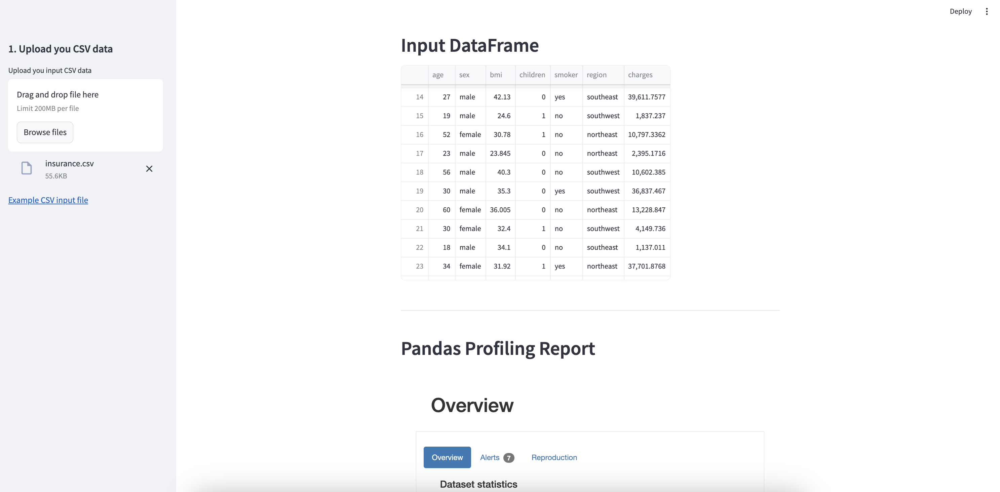

# 🧪 The EDA App

## Overview
The EDA App is an exploratory data analysis tool built with Streamlit and powered by the pandas-profiling library. This app allows you to upload your CSV data, view it interactively, and generate comprehensive EDA reports with ease.




## ✨ Features
📂 CSV Upload: Easily upload your CSV files for instant exploration.
👀 Interactive DataFrame Display: View your data directly within the app.
📊 Pandas Profiling Report: Generate a detailed profiling report with insights into your dataset.

🚀 Getting Started
🛠️ Prerequisites

## Ensure you have the following installed:

Python 3.7 or higher
pip (Python package installer)

## 📥 Installation

### Clone the Repository:

```sh
git clone https://github.com/RoaaM/EDA-project
cd EDA-project
```

### Create and Activate a Virtual Environment (optional but recommended):

```sh
python -m venv venv
source venv/bin/activate  # On Windows, use `venv\Scripts\activate`

```

### Install Dependencies:

```sh
pip install -r requirements.txt
```

## 🏃 Running the Application

### To start the Streamlit application, run the following command:

```sh
streamlit run eda_app.py
```

This will open the application in your web browser at http://localhost:8501.

## ⚙️ How It Works
Upload your CSV Data: Use the sidebar to upload your CSV file.
View the DataFrame: The uploaded data will be displayed within the app.
Generate EDA Report: A comprehensive report will be generated using pandas-profiling and displayed within the app.

## 🧑‍💻 Example Usage
Upload a CSV file: Upload your own data or use the provided example file.
Explore the Data: View the data and understand its structure.
Generate the Report: Review the insights generated by the EDA report.
